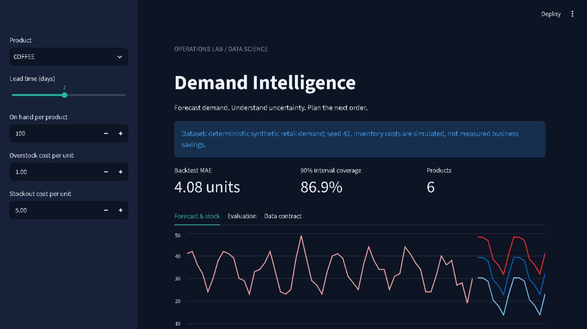
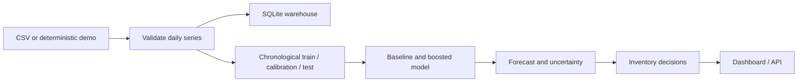

# Retail Demand Intelligence

Daily product forecasts and an interactive replenishment planner, with a reproducible training pipeline, temporal backtests and a FastAPI service.



## Run locally

Python 3.14 was used for verification. From this repository:

```bash
python -m venv .venv
# Windows: .venv\Scripts\activate
# macOS/Linux: source .venv/bin/activate
pip install -r requirements.txt
python -m retail.train
python -m pytest -q
streamlit run app.py
```

The dashboard opens on port 8501. Training generates the data, local SQLite warehouse, model artifact and reports without requiring credentials. To start the API instead:

```bash
uvicorn retail.api:app --host 127.0.0.1 --port 8001
```

Interactive API documentation: `http://127.0.0.1:8001/docs`. `GET /forecast` returns 14-day forecasts; `POST /inventory` accepts on_hand, lead_days, holding_cost and stockout_cost.

## What this demonstrates

- Direct forecasts for horizons 1–14 using lagged demand, seasonality and SKU features.
- Seasonal-naive baseline versus histogram gradient boosting.
- Three non-overlapping test windows, each with a separate 28-day calibration period.
- Approximate 90% residual intervals and measured out-of-time coverage.
- Cost-sensitive inventory planning with downloadable order quantities.
- SQL aggregation, data contracts, API validation and leakage regression tests.



## Data and evaluation

The bundled data is **synthetic**, generated by `retail.core.demo_data(seed=42)`. It is not M5 or a real retailer dataset. All reported metrics come from running this code; no real revenue or savings are claimed. See [results](reports/RESULTS.md), [fold metrics](reports/backtest.csv), and [model card](reports/model_card.json).

To use your own data:

```bash
python -m retail.train --csv data/private/demand.csv
```

Required columns: `date,sku,units`. Each SKU needs at least 120 consecutive daily records, a common final date, non-negative finite demand and no duplicate dates. Missing days are rejected instead of silently treated as zero. `data/analysis.sql` runs against the generated warehouse. Private inputs belong in the ignored `data/private/` folder; generated reports may contain information derived from those inputs, so review before publishing.

## Design decisions and limits

Features use only history before the forecast origin. Training labels end before calibration origins. Test outcomes are never used for fitting. The final model deliberately preserves the calibration holdout instead of refitting on it and invalidating residual calibration.

Intervals are empirical and do not guarantee coverage under temporal dependence or drift. The inventory planner approximates daily errors as independent normal variables and assumes one replenishment cycle. Backtest cost is a simpler fixed-window stock comparison, not a full supply-chain simulator. Sales censored by stockouts are not true demand. Promotions, supplier capacity and multi-store hierarchies are not modelled.

## Deployment

```bash
docker build -t retail-demand .
docker run --rm -p 8501:8501 retail-demand
```

Docker builds train a fresh model. Docker configuration is provided; check the verification report for what was actually exercised. The API is intended for a local demo; add authentication, resource limits and an appropriate data store before public service deployment. Never load model artifacts from untrusted sources.

## Repository guide

`retail/core.py`: modelling and planning · `retail/train.py`: reproducible experiment · `retail/api.py`: serving · `app.py`: dashboard · `tests/`: behavioural tests · `reports/`: measured results.

Created with AI coding assistance. Reproduce the experiment and understand the design decisions before presenting it as portfolio work. MIT licensed; generated synthetic data is included under the same licence.
